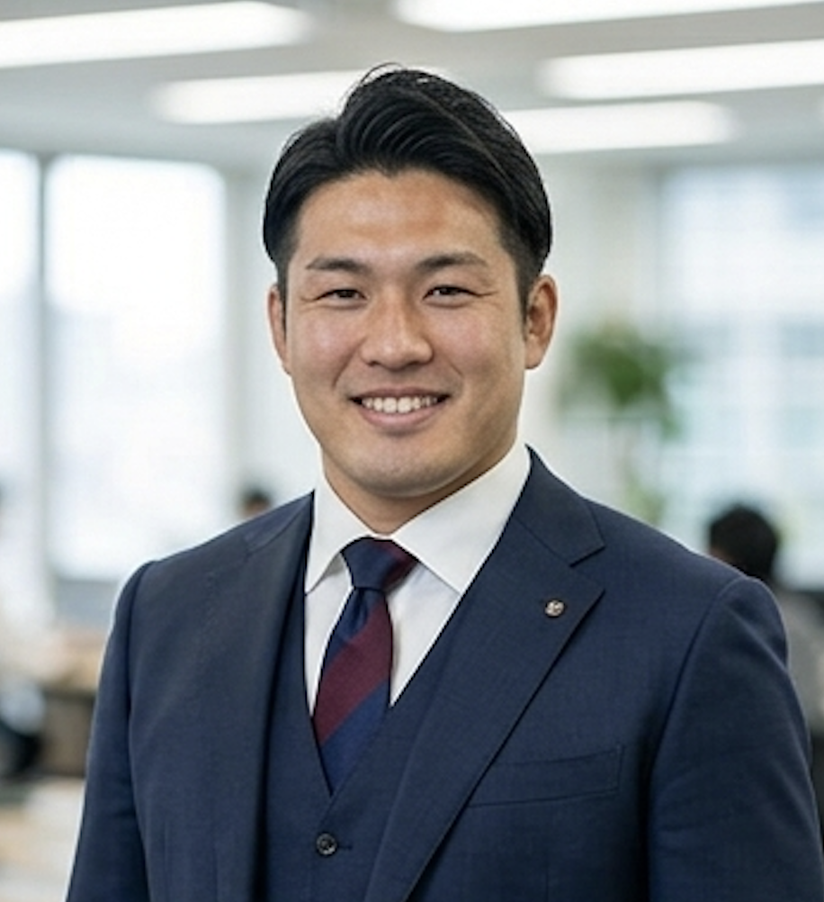
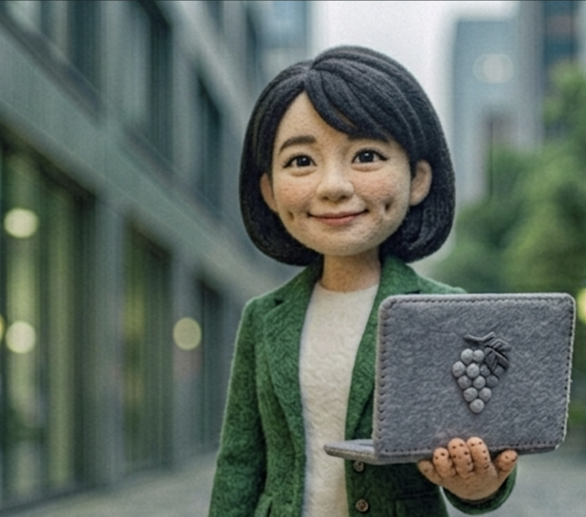

# ishidue-ai-avatars

ISHIDUE の役員 AI アバター画像と、それを同じ画風で作り続けるための仕様・プロンプト一式。

**画風は羊毛フェルト人形風（needle-felted wool doll）に統一する。**
仕様は [`docs/style-guide.md`](docs/style-guide.md)。

## ギャラリー

### 基準画像（フェルト風）

この 2 枚がシリーズの「正」。仕様文と食い違ったときはこちらを優先する。

| CEO | 秘書 |
|:---:|:---:|
|  |  |

### 差し替え対象（旧・実写風）

7 名は画風が異なるため作り直しが必要。現画像は人物の顔・髪型・服装の**参照元**として使う。

| COO | CFO | CTO |
|:---:|:---:|:---:|
|  |  |  |

| CMO | CSO | CHRO | CLO |
|:---:|:---:|:---:|:---:|
|  |  |  |  |

## ステータス

| 役職 | ファイル | 画風 | 状態 | プロンプト |
|---|---|---|---|---|
| 最高経営責任者 | `ceo.jpg` | フェルト風 | ✅ 基準 | [ceo.txt](prompts/out/ceo.txt) |
| 秘書 | `secretary.jpg` | フェルト風 | ✅ 基準 | [secretary.txt](prompts/out/secretary.txt) |
| 最高執行責任者 | `coo.jpg` | 実写風 | ⏳ 作り直し | [coo.txt](prompts/out/coo.txt) |
| 最高財務責任者 | `cfo.jpg` | 実写風 | ⏳ 作り直し | [cfo.txt](prompts/out/cfo.txt) |
| 最高技術責任者 | `cto.jpg` | 実写風 | ⏳ 作り直し | [cto.txt](prompts/out/cto.txt) |
| 最高マーケティング責任者 | `cmo.jpg` | 実写風 | ⏳ 作り直し | [cmo.txt](prompts/out/cmo.txt) |
| 最高戦略責任者 | `cso.jpg` | 実写風 | ⏳ 作り直し | [cso.txt](prompts/out/cso.txt) |
| 最高人事責任者 | `chro.jpg` | 実写風 | ⏳ 作り直し | [chro.txt](prompts/out/chro.txt) |
| 最高法務責任者 | `clo.jpg` | 実写風 | ⏳ 作り直し | [clo.txt](prompts/out/clo.txt) |

構造化された一覧は [`avatars.json`](avatars.json)。

## 使い方

アバターを 1 体作るとき:

```bash
cat prompts/out/cfo.txt        # コピペ用プロンプトを開く
```

`=== PROMPT ===` と `=== NEGATIVE PROMPT ===` をそれぞれ画像生成ツールに貼る。
出力の確認項目は [`prompts/README.md`](prompts/README.md) のチェックリストを使う。

プロンプトを直したとき:

```bash
python3 scripts/build_prompts.py           # prompts/out/ を再生成
python3 scripts/build_prompts.py --check   # 生成物が最新かだけ確認
```

## 構成

```
├── *.jpg                  アバター画像 9 枚（役職名 = ファイル名）
├── avatars.json           カタログ（役職・画風・状態・既知の問題）
├── docs/
│   └── style-guide.md     フェルト風の画風仕様
├── prompts/
│   ├── README.md          プロンプトの使い方とチェックリスト
│   ├── _base.md           共通スタイルブロック（正本）
│   ├── subjects/*.md      役職ごとの被写体記述
│   └── out/*.txt          生成物（コピペ用・手で編集しない）
└── scripts/
    └── build_prompts.py   _base.md + subjects → out/ を生成
```

## 注意点

- **拡張子が実体と一致していない。** 9 枚すべて `.jpg` だが中身は PNG (RGBA)。
  外部から `raw.githubusercontent.com` 経由で参照されている可能性があるため、
  今回は改名していない。改名する場合は参照元の有無を確認してから行うこと。
- **既存の実写画像 3 枚に写り込みがある。** `chro` 右下に別画像のサムネイル、
  `cmo` 左下に「ステム設定」の文字、`cso` 左下に黒い点。作り直し時に持ち込まないこと。
- **CSO と CLO の日本語役職名は未確定。** 暫定で最高戦略責任者／最高法務責任者としている。
